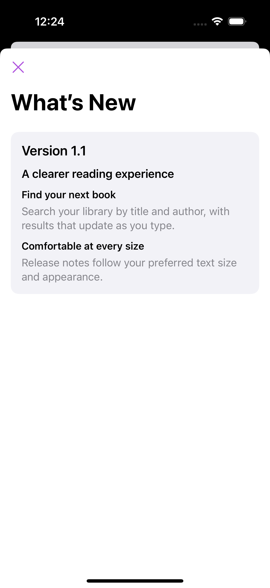
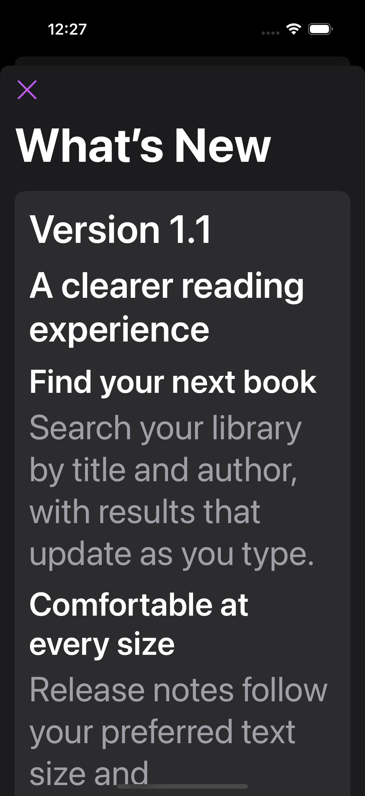

# ChangeView

A small SwiftUI package for What's New and changelog screens, backed by your
app's JSON release notes. Requires Swift 6.2 and iOS 17 or later.

## Installation

Add `https://github.com/Xzese/SwiftChangeView` in Xcode's **Add Package
Dependencies**, then select the `ChangeView` product. This work is on
`portfolio-modernisation` until PR #2 merges. The repository does not yet have
version tags; select a branch or commit rather than an unavailable release.

Import `ChangeView` and include `changelog.json` in your app target's resources.
The package name, product, module and minimum requirements are unchanged.

## Show What's New after an update

This complete example keeps the existing initializer calls. It records the
installed version when the sheet closes, including an interactive dismissal.

```swift
import SwiftUI
import ChangeView

struct ContentView: View {
    @AppStorage("lastSeenVersion") private var lastSeenVersion = ""
    @State private var showWhatsNew = false

    private var currentVersion: String {
        Bundle.main.infoDictionary?["CFBundleShortVersionString"] as? String ?? "0"
    }

    var body: some View {
        Button("What's New") { showWhatsNew = true }
            .sheet(isPresented: $showWhatsNew, onDismiss: {
                lastSeenVersion = currentVersion
            }) {
                WhatsNewView(
                    onDismiss: { showWhatsNew = false },
                    lastSeenVersion: lastSeenVersion,
                    tintColor: .purple
                )
            }
            .onAppear {
                showWhatsNew = compareVersionStrings(lastSeenVersion, currentVersion)
            }
    }
}
```

What's New shows `lastSeenVersion < entry.version <= currentVersion`, newest
first. A missing, empty or `"0"` last-seen value shows all releases through the
installed version. A saved version equal to or above the installed version
shows no releases. Future entries are excluded even on first launch.

For previews and tests, pass public models and an explicit installed version:

```swift
WhatsNewView(
    onDismiss: {},
    lastSeenVersion: "1.0",
    changelog: [
        VersionEntry(version: "1.1", title: "Library updates", changes: [
            ChangeItem(title: "Search", description: "Find a book by its title.")
        ])
    ],
    currentVersion: "1.1"
)
```

## Add a full changelog

Both views provide their own navigation stack by default, preserving existing
sheet usage. When pushing from a navigation link, disable that inner stack:

```swift
struct ChangelogDestination: View {
    @Environment(\.dismiss) private var dismiss

    var body: some View {
        ChangelogScreen(
            onDismiss: { dismiss() },
            tintColor: .purple,
            embedsInNavigationStack: false
        )
    }
}
```

`ChangelogScreen` shows all releases, newest first. Both views apply the supplied
tint to controls, use system fonts that scale with Dynamic Type, mark release
headings for accessibility, and label their Close button. They distinguish
empty release notes from loading or decoding failures.

## JSON and identity

Existing JSON remains valid without any IDs:

```json
[
  {
    "version": "1.1",
    "title": "Library updates",
    "changes": [
      {"title": "Search", "description": "Find a book by its title."}
    ]
  }
]
```

`VersionEntry` and `ChangeItem` now expose public read-only properties and
initializers. Their stored IDs are UUIDs and stay the same when accessed or
copied. `VersionEntry.id` retains its original public `UUID` type. To preserve
identity across separate loads, include an optional UUID `id` in each release
and change, or reuse your decoded models. Missing IDs are generated once during
decoding. Non-UUID legacy `id` metadata is ignored, as it was by the original
decoders. Encoding includes these additive ID fields, which the original
package's Codable models also accept.

## Validation and compatibility

Existing view calls, bundle loading, JSON keys and the
`compareVersionStrings(_:_:)` signature remain supported. The views default to
`.compatible` validation, retaining the original helper's parsing: components
that cannot be parsed as integers are skipped, and missing components compare
as zero. The helper intentionally keeps that behavior for existing callers.
It is not a Semantic Versioning parser.

For new data, prefer `.strict` validation. Strict versions consist of
non-negative integer components separated by dots (each must fit in `Int`),
such as `1`, `1.2` or `1.0.10`. Prerelease/build suffixes, whitespace and empty
components are rejected. Leading zeros are accepted, and trailing zeros compare
equally: `1.0 == 1.0.0`. Duplicate equivalent versions, duplicate release IDs
and duplicate change IDs within a release are rejected.

```swift
let entries = try Changelog.load() // Strict validation by default.
let visible = try Changelog.entriesToShow(
    entries, lastSeenVersion: "1.0", currentVersion: "1.1"
)
let version = try AppVersion("1.1")
```

`Changelog.decode`, `Changelog.load` and `Changelog.entriesToShow` accept
`validation: .compatible` for older data. `Changelog.validate` always validates
strictly. Both views accept `validation: .strict` as an opt-in, and `bundle:`
allows loading release notes from a different resource bundle. For What's New,
`currentVersion:` overrides `CFBundleShortVersionString` from that bundle.

Two deliberate behavior fixes apply to existing views: What's New no longer
includes future releases, and empty or malformed data no longer invents
"Bug fixes and improvements" release notes. Missing bundle version metadata
continues to fall back to `"0"`; supply `currentVersion:` when previewing data.

## Example and checks

[The external iOS consumer](Examples/ChangeViewExample) includes its own JSON,
imports the public library, and demonstrates sheets, embedded navigation,
empty/error states and update persistence. Open its shared Xcode scheme to run
it. Its two UI tests cover a complete release-note journey and dark appearance
with an accessibility Dynamic Type size.

Run `swift test` for the public model, legacy JSON, numeric comparison,
validation and release-selection tests. CI also builds the iOS library and
runs the external consumer UI tests, saving their result bundle and screenshot
attachments. See [.github/PORTFOLIO_MODERNISATION.md](.github/PORTFOLIO_MODERNISATION.md)
for verified checks and remaining release review.

### Simulator screenshots

Captured from the external consumer on iPhone 16 Pro, iOS 18.0:

| Default text, light | Accessibility text, dark |
| --- | --- |
|  |  |

The large-text screen scrolls to reach the remaining release notes.

## Release guidance

Merge after CI passes, review the consumer manually with VoiceOver, and test
on your app's oldest supported iOS version. Keep the existing Swift 6.2/iOS 17
requirements for this update. Create the repository's first semantic version
tag only after those checks; consumers can then switch from a branch to a
version requirement. Any future change to existing signatures, ID types or
compatibility parsing needs an explicit migration plan.

## Licence

[MIT](LICENSE). The original project history and licence are unchanged.
